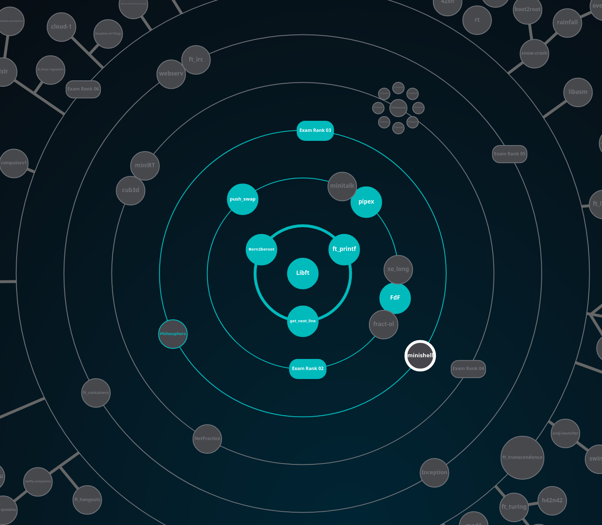

# QJungo 42 Cursus
Here is all the project done so far in the 42 school cursus

| Order | Circle | Project                                                                                   | Tech | Status |
|:-----:|:------:|:------------------------------------------------------------------------------------------|:----:|:------:|
|  01   |   00   | [**LIBFT**](https://github.com/QJungo-42Cursus/libft)                                     |  C   |   ✔    |
|  02   |   01   | [**FT_PRINTF**](https://github.com/QJungo-42Cursus/ft_printf)                             |  C   |   ✔    |
|  03   |   01   | [**GET_NEXT_LINE**](https://github.com/QJungo-42Cursus/libft/blob/master/get_next_line.c) |  C   |   ✔    |
|  04   |   02   | [**PUSH_SWAP**](https://github.com/QJungo-42Cursus/push_swap)                             |  C   |   ✔    |
|  05   |   02   | [**PIPEX**](https://github.com/QJungo-42Cursus/pipex)                                     |  C   |   ✔    |
|  06   |   02   | [**FDF**](https://github.com/QJungo-42Cursus/fdf)                                         |  C   |   ✔    |
|  07   |   03   | [**MINISHELL**](https://github.com/JungoQuentin/minishell)                                |  C   |   📌   |
|  08   |   03   | [**PHILOSOPHERS**](https://github.com/QJungo-42Cursus/philosophers)                       |  C   |   📂   |
|  09   |   04   | [**PISCINE CPP**](https://github.com/QJungo-42Cursus/cpp)                                 |  C   |   📂   |
|  10   |   05   | [**FT_CONTAINERS**](https://github.com/QJungo-42Cursus/ft_containers)                     |  C   |   📂   |

